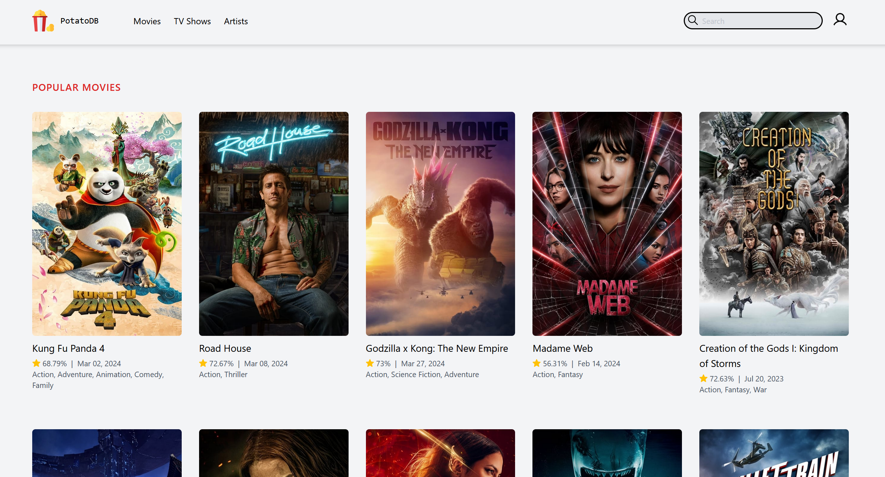
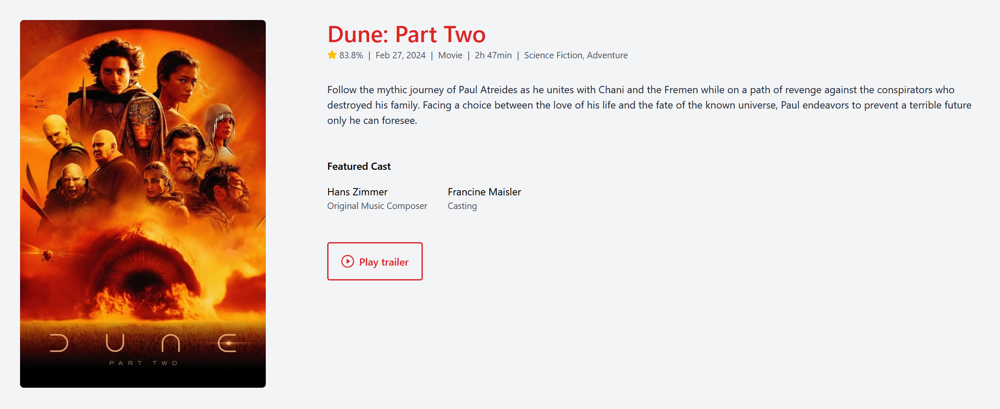
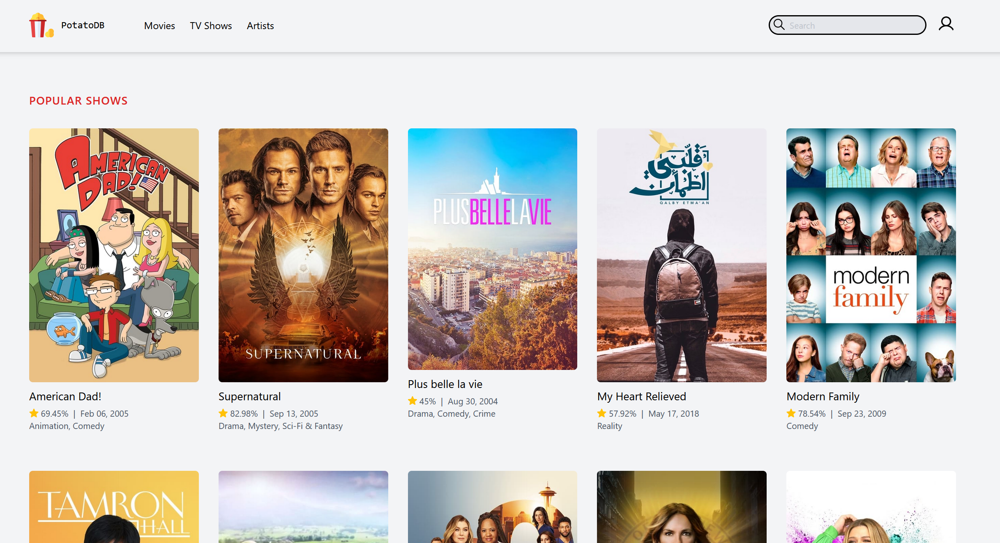

# potatodb - The Movie Information Web App

## Overview

potatodb is a full-stack application that provides real-time movie details, including titles, cast information, and posters. Built using Laravel, Tailwind CSS, and Laravel Livewire, this project demonstrates proficiency in backend development, frontend styling, and dynamic interactions.

## Features

- **Backend Development (Laravel 11.0)**
    - Designed RESTful APIs for movie data retrieval.
    - Achieved high performance through optimized database queries and caching.
    - Average API response time: <100ms.

- **Responsive UI (Tailwind CSS)**
    - Created visually appealing UI components (movie cards, search filters, etc).
    - Ensured consistent styling across mobile and desktop views.

- **Real-Time Interactions (Laravel Livewire)**
    - Implemented instant movie search suggestions.
    - Lazy loading for improved page rendering.

- **TMDB API Integration**
    - Fetch movie data (titles, cast, likes, posters) from The Movie Database (TMDB) REST API.
    - Reduced external API requests by 70% using caching strategies.

## App screenshots








## Setup Instructions

1. Clone the repository:
   ```
   git clone https://github.com/kumarsandeep567/potatodb.git
   ```

2. Install Apache Server and PHP (or install XAMPP to install both)

3. Get TMDB API from https://developer.themoviedb.org/docs/getting-started

4. Configure environment variables:
   - Create a `.env` file based on `.env.example`.
   - Set `APP_NAME=PotatoDB` 
   - Set your TMDB API key at the end of the `.env` file by adding this line  `TMDB_TOKEN=PASTE_YOUR_TOKEN_HERE`

5. Open `potatodb` in the terminal and run migrations and seed data:
   ```
   php artisan migrate --seed
   ```

6. Finally start the development server:
   ```
   php artisan serve
   ```
